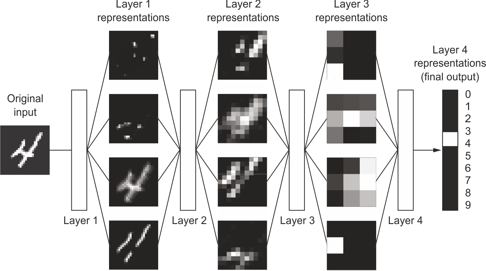
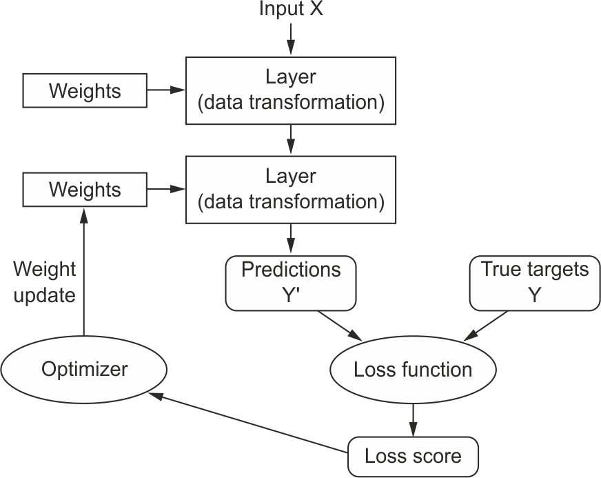

# Machine Learning

## AI, ML, Deep Learning

### Artificial Intelligence

AI is a general field that encompasses machine learning and deep learning, with many more other approaches (such as chess AI).

Before machine learning, symbolic AI was the dominant paradigm, which reached its peak during the 1980s. Symbolic AI is done by having programmers handcraft a sufficiently large set of explicit rules for manipulating knowledge. It is suitable to solve well-defined, logical problems, such as playing chess, it turned out to be intractable to figure out explicit rules for solving more complex, fuzzy problems, such as image classification, speech recognition, and language translation.

### Machine Learning

Machine learning is a subfield of AI, containing multiple methods including deep learning.

In symbolic AI, humans input rules (a program) and data to be processed according to these rules, and out come answers. With machine learning, humans input data as well as the answers expected from the data, and out come the rules. These rules can then be applied to new data to produce original answers.

The difference between symbolic AI and machine learning is that machine learning is **trained** rather than explicitly programmed. It’s presented with many examples relevant to a task, and it finds statistical structure in these examples that eventually allows the system to come up with rules for automating the task.

### "Learning"

3 things are needed for machine learning.

- Input data points - if the task is image tagging, the input would be pictures.

- Examples of the expected output - for image tagging, this would be tags such as "cat".

- A way to measure whether  the algorithm is doing a good job - This is necessary in order to determine the distance between the algorithm’s current output and its expected output. The measurement is used as a feedback signal to adjust the way the algorithm works. This adjustment step is what we call **learning**.

A machine-learning model transforms its input data into meaningful outputs, a process that is “learned” from exposure to known examples of inputs and outputs. Therefore, the central problem in machine learning and deep learning is to meaningfully transform data: in other words, to learn useful **representations** of the input data at hand—representations that get us closer to the expected output.

### Deep Learning

The "deep" in deep learning stands for the idea of learning successive layers of increasingly meaningful representations. Modern deep learning often involves tens or even hundreds of successive layers of representations. Other approaches to machine learning tend to focus on learning only one or two layers of representations of the data; hence, they’re sometimes called **shallow learning**.

In deep learning, these layered representations are (almost always) learned via models called **neural networks**, structured in literal layers stacked on top of each other.

#### How Deep Learning Works

The specification of what a layer does to its input data is stored in the layer’s **weights**, which in essence are a bunch of numbers. In technical terms, we’d say that the transformation implemented by a layer is **parameterized** by its weights. (Weights are also sometimes called the **parameters** of a layer.) Learning means finding a set of values for the weights of all layers in a network, such that the network will correctly map example inputs to their associated targets. A deep neural network can contain tens of millions of parameters.

To control the output of a neural network, you need to be able to measure how far this output is from what you expected. This is the job of the **loss function** of the network, also called the **objective function**. The loss function takes the predictions of the network and the true target (what you wanted the network to output) and computes a distance score, capturing how well the network has done on this specific example.

Deep learning use this score as a feedback signal to adjust the value of the weights a little, in a direction that will lower the loss score for the current example. This adjustment is the job of the **optimizer**, which implements what’s called the **Backpropagation** algorithm: the central algorithm in deep learning.

Initially, the weights of the network are assigned random values, so the network merely implements a series of random transformations. Naturally, its output is far from what it should ideally be, and the loss score is accordingly very high. But with every example the network processes, the weights are adjusted a little in the correct direction, and the loss score decreases. This is the **training loop**, which, repeated a sufficient number of times (typically tens of iterations over thousands of examples), yields weight values that minimize the loss function. A network with a minimal loss is one for which the outputs are as close as they can be to the targets: a trained network.

### Other Types of Machine Learning

#### Probabilistic Modeling

**Probabilistic modeling** is the application of the principles of statistics to data analysis. It was one of the earliest forms of machine learning, and it’s still widely used to this day. One of the best-known algorithms in this category is the Naive Bayes algorithm.

A closely related model is the **logistic regression** (logreg for short), which is sometimes considered to be the “hello world” of modern machine learning. Logreg is a classification algorithm rather than a regression algorithm. It’s often the first thing a data scientist will try on a dataset to get a feel for the classification task at hand.

#### Kernel Methods

**Kernel methods** are a group of classification algorithms, the best known of which is the **support vector machine** (SVM).

SVMs aim at solving classification problems by finding good **decision boundaries** between two sets of points belonging to two different categories. A decision boundary can be thought of as a line or surface separating your training data into two spaces corresponding to two categories.

But SVMs proved hard to scale to large datasets and didn’t provide good results for perceptual problems such as image classification. Because an SVM is a shallow method, applying an SVM to perceptual problems requires first extracting useful representations manually (a step called **feature engineering**), which is difficult and brittle.

#### Decision Trees, Random Forests, Gradient Boosting Machines

**Decision trees** are flowchart-like structures that let you classify input data points or predict output values given inputs. They’re easy to visualize and interpret.

**Random Forest** algorithm introduced a robust, practical take on decision-tree learning that involves building a large number of specialized decision trees and then ensembling their outputs.

**Gradient boosting machine**, much like a random forest, is a machine-learning technique based on ensembling weak prediction models, generally decision trees. It uses **gradient boosting**, a way to improve any machine-learning model by iteratively training new models that specialize in addressing the weak points of the previous models. Applied to decision trees, the use of the gradient boosting technique results in models that strictly outperform random forests most of the time, while having similar properties. It may be one of the best, if not the best, algorithm for dealing with nonperceptual data today.

Gradient boosting is used for problems where structured data is available, whereas deep learning is used for perceptual problems such as image classification. Practitioners of the former almost always use the excellent XGBoost library, which offers support for the two most popular languages of data science: Python and R. Meanwhile, most of the Kaggle entrants using deep learning use the Keras library, due to its ease of use, flexibility, and support of Python.

## Resource
- [Deep Learning with Python](https://www.manning.com/books/deep-learning-with-python)

[Back](../../README.md)
